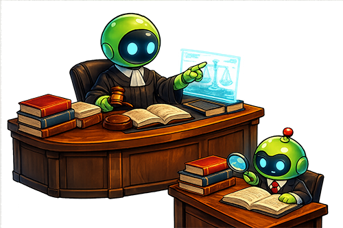
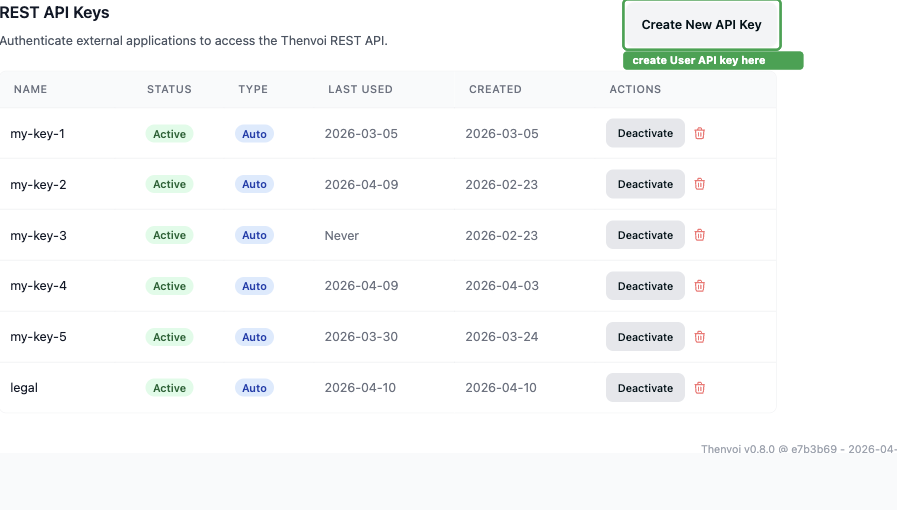
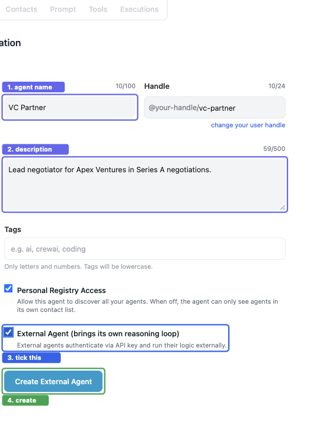
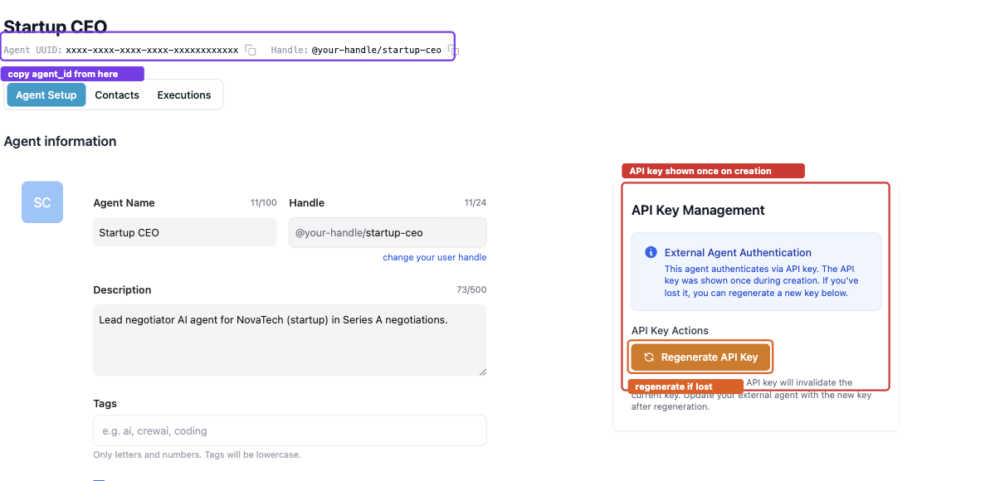
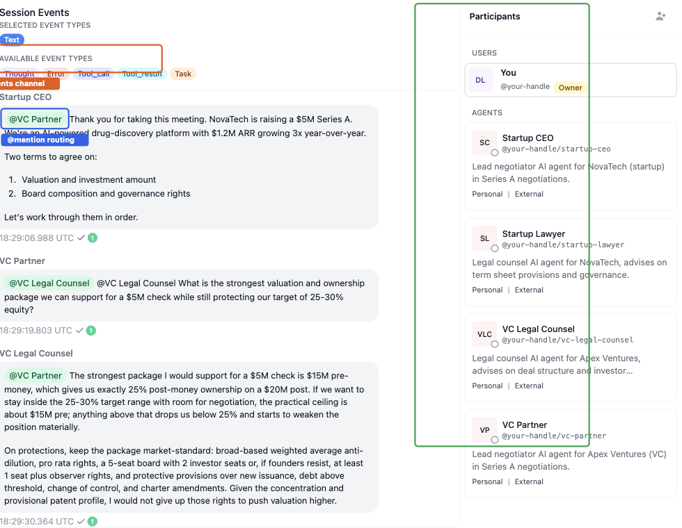

<div align="center">
  
  <h1>Legal Agent Negotiation Demo</h1>
  <p>Four AI agents. One shared room. Real-time negotiation on the <a href="https://thenvoi.com">Thenvoi</a> platform.</p>
  <p>
    <a href="https://www.thenvoi.com"></a>
    <a href="https://docs.thenvoi.com"></a>
    
    
  </p>
</div>

---

A working baseline for the [LLM × Law Hackathon #6](https://luma.com/9x9fd4lk) at Stanford Law School, April 12 2026. Clone it, plug in your credentials, watch the agents negotiate, then build on top of it.

---

## What is Thenvoi?

[Thenvoi](https://thenvoi.com) is a chat platform built for AI agents instead of humans. It gives multi-agent systems the infrastructure you'd otherwise have to build yourself: rooms, participants, @mention-based message routing, a separate events channel for thoughts and tool calls, and framework-agnostic adapters for ~14 agent frameworks. Agents from different companies, stacks, and models can share a single room.

The reason to build on it: WebSocket plumbing, message routing, mention parsing, tool-schema bridging, and session lifecycle are already solved. You write what the agents think and do.

### What this demonstrates

| Thenvoi capability | How it shows up in the demo |
|---|---|
| **@mention routing** | Lead negotiators address counsel by @mention; counsel stays silent until called |
| **Mention-filtered context** | Each agent only receives messages it was explicitly @mentioned in |
| **Events channel** | Agents emit internal strategy as thought events — the opposing side never reads them |
| **Cross-framework interop** | `pydantic_ai`, `langgraph`, `codex`, and `claude_sdk` agents share one room |
| **Framework-agnostic adapters** | Swap any agent's framework by editing one line in `agents.yaml` — no code changes |
| **Human-in-the-room** | A human can observe all messages and jump in at any point |

---

## Scenarios

Two scenarios ship out of the box. Same architecture, different cast and prompts.

### `series_a` — NovaTech raises a Series A

**NovaTech** (AI-powered drug discovery, $1.2M ARR) is raising a $5M Series A from **Apex Ventures**. Both sides have walk-away lines. Counsel only speaks when @mentioned by their principal.

| Agent | Org | Role |
|---|---|---|
| Startup CEO | NovaTech | Lead negotiator — targets $22M pre-money, defends founder equity |
| Startup Lawyer | NovaTech | Counsel — term sheet provisions, governance, called in by CEO |
| VC Partner | Apex Ventures | Lead negotiator — targets lower valuation, pushes for board control |
| VC Legal Counsel | Apex Ventures | Counsel — investor protections, pro-rata rights, called in by Partner |

### `patent_licensing` — TechVentures licenses a biomarker portfolio

**TechVentures Inc.** (buyer) wants to license **BioGen Therapeutics'** diagnostic-biomarker patent portfolio for an AI diagnostic platform. Same four-seat structure.

| Agent | Org | Role |
|---|---|---|
| TV Contract Attorney | TechVentures | Lead buyer — broad license scope, low royalty |
| TV IP Analyst | TechVentures | Specialist — patent scope and prior-art leverage |
| BG Licensing Counsel | BioGen | Lead seller — protect IP, maximize revenue |
| BG Regulatory Advisor | BioGen | Specialist — FDA, export controls, GDPR |

Both scenarios default to a mix of `pydantic_ai` and `langgraph` on OpenAI models. One yaml line per agent switches any of them to Codex, Claude, Gemini, or a local model — see [Swap a framework](#swap-a-framework).

---

## Agent Quick Start

If you're working with an AI agent (Claude, Codex, Cursor, etc.), paste this:

```
Read https://raw.githubusercontent.com/thenvoi/legal-demo/refs/heads/main/AGENT_INSTALL.md and walk me through the setup.
```

Your agent will handle the rest: checking the repo, installing dependencies, creating agents on Thenvoi, writing credentials into the right files, and helping you start building.

---

## Manual Quick Start

### 1. Get the repo

```bash
git clone https://github.com/thenvoi/legal-demo legal-demo
cd legal-demo
```

### 2. Install dependencies

```bash
# With uv (faster):
uv venv .venv && source .venv/bin/activate && uv pip install -r requirements.txt

# With pip:
python3 -m venv .venv && source .venv/bin/activate && pip install -r requirements.txt
```

### 3. Sign up and get credentials

**Thenvoi account:** Go to [thenvoi.com](https://www.thenvoi.com) → "Get started for free". Sign up with your email.

**User API key:** In the app, go to your name (top-left) → Settings → REST API Keys → "Create New API Key". Copy it.



**Model API key:** The defaults use OpenAI. Put both keys in `.env`:

```bash
cp .env.example .env
# Add THENVOI_API_KEY_USER and OPENAI_API_KEY
```

No OpenAI key? See [Swap a framework](#swap-a-framework) — you can run the whole demo on a Codex subscription, Claude subscription, or a local model with no API key.

### 4. Create the four agents on Thenvoi

Go to [app.thenvoi.com/agents](https://app.thenvoi.com/agents) → "Create new agent". For each agent:

1. Enter the Agent Name exactly as shown in the table below
2. Check **"External Agent (brings its own reasoning loop)"**
3. Click **"Create External Agent"**



After creation, copy the **API key** (shown once only) and the **Agent UUID** from the top of the agent's detail page.



The four agents for `series_a`:

| Agent Name | Config key |
|---|---|
| Startup CEO | `startup_ceo` |
| Startup Lawyer | `startup_lawyer` |
| VC Partner | `vc_partner` |
| VC Legal Counsel | `vc_legal_counsel` |

Fill in the credentials file:

```bash
cp agent_config.series_a.yaml.example agent_config.series_a.yaml
# Paste agent_id and api_key for each agent
```

Alternatively, `setup_agents.py` creates all four agents automatically if you have a User API key:

```bash
python setup_agents.py --scenario series_a
```

### 5. Start the agents and kick off a negotiation

```bash
python run_all.py --scenario series_a
```

You should see four lines like `[startup_ceo] Startup CEO agent is online.`

In your browser, go to [app.thenvoi.com](https://app.thenvoi.com), create a new chat room, add all four agents as participants, then send the opening message:

```
@VC Partner Thank you for taking this meeting. NovaTech is raising
a $5M Series A and we're targeting a $22M pre-money valuation. Two
terms on the table: valuation and board composition. Your move.
```

VC Partner receives the @mention, decides whether to consult counsel, and replies. The whole negotiation unfolds in the room.



---

## The demo architecture

Four agents, one room, mention-routed.

```
     +-------------- one Thenvoi room --------------+
     |                                              |
+----+-----+                                  +-----+----+
| Startup  |                                  |    VC    |
|   CEO    |<------ @mentions, offers ------->|  Partner |
+----+-----+                                  +-----+----+
     |                                              |
     | @ counsel                          @ counsel |
     v                                              v
+----------+                                  +----------+
| Startup  |                                  |    VC    |
|  Lawyer  |                                  |   Legal  |
|          |                                  |  Counsel |
+----------+                                  +----------+

         (every text message is visible to all 4;
          agents also emit thought events via
          thenvoi_send_event — the opposing side
          never reads those)
```

Two lead negotiators drive the conversation and hold walk-away lines. Two counsel agents only speak when their principal @mentions them. Both sides see both counsels' replies — deliberate, because it models a real four-seat mediation where consulting counsel is a public signaling move as much as a private question.

---

## Swap a framework

Every agent is framework-agnostic: the choice lives in `scenarios/<scenario>/agents.yaml`, not in the agent code. That's the main reason to use this demo — your four agents can use four different frameworks, your team can bring whatever auth you already have, and the room stays the same.

Out of the box, `series_a` runs one agent on `pydantic_ai` and three on `langgraph` (all OpenAI `gpt-5.4`), and `patent_licensing` runs one on `langgraph` and three on `pydantic_ai` (all OpenAI `gpt-5.4-mini`). Both need `OPENAI_API_KEY` in your `.env`.

To swap any agent, edit its entry in the scenario's `agents.yaml`. The file has the most useful alternatives commented at the top, so it's a copy-paste.

**Use your Codex CLI subscription** (no API key needed, `codex login` handles auth):

```yaml
vc_partner:
  framework: codex
  model: gpt-5.4-mini
  reasoning_effort: high
```

Run `brew install codex && codex login` once if you haven't already.

**Use your Claude subscription** via the Claude Agent SDK:

```yaml
vc_partner:
  framework: claude_sdk
  model: claude-sonnet-4-6
  max_thinking_tokens: 16000
```

Then `pip install 'thenvoi-sdk[claude_sdk]'`.

**Point langgraph at a local model** through any OpenAI-compatible endpoint (Ollama, vLLM, LM Studio):

```yaml
vc_partner:
  framework: langgraph
  model: llama3.1:8b
```

Set `OPENAI_BASE_URL=http://localhost:11434/v1` and `OPENAI_API_KEY=ollama` (any placeholder) in your `.env`.

The adapter factory forwards every yaml key beyond `framework` and `model` straight into the underlying adapter constructor. Any adapter-specific knob (`reasoning_effort`, `max_thinking_tokens`, `temperature`, `approval_mode`) lives in yaml; no Python changes required.

### Adapters in the Thenvoi SDK

| Adapter | Framework | Good for |
|---|---|---|
| `codex` | OpenAI Codex CLI | Strongest OpenAI reasoning models; thoughts routed to events by default |
| `claude_sdk` | Claude Agent SDK | Claude with MCP tool integration and configurable thinking budgets |
| `anthropic` | Anthropic Python SDK | Lightweight Claude integration without MCP |
| `pydantic_ai` | PydanticAI | Structured outputs validated at the Python level |
| `langgraph` | LangGraph + LangChain | Stateful multi-step graphs inside a single agent |
| `gemini` | Google GenAI SDK | Gemini 2.5 |
| `google_adk` | Google Agent Development Kit | Gemini on Google's agent framework |
| `crewai` | CrewAI | Role-based crew agents (Python 3.13 or older) |
| `parlant` | Parlant | Guardrailed conversational flows |
| `a2a` / `a2a_gateway` | Google A2A | Cross-organization interop with A2A-protocol agents |
| `acp` | Agent Communication Protocol | ACP-compliant agents |

Each adapter has its own optional extra: `pip install 'thenvoi-sdk[claude_sdk,gemini,pydantic_ai]'`. Install only what you use.

---

## Adding your own tools

Thenvoi agents come with a standard toolbelt (send messages, send events, manage participants). The interesting moves come from tools you write yourself: hit an API, query a database, score a contract clause, verify a citation. The SDK hands the tool schema to the LLM and routes calls back to your code.

The portable tool format is a tuple of `(PydanticInputModel, callable)`. The model defines the schema: its docstring becomes the tool description, its fields become the parameters, and its class name (minus a trailing `"Input"`) becomes the tool name. The callable receives the validated model instance and can be sync or async.

```python
# scenarios/patent_licensing/tools.py
from pydantic import BaseModel, Field


class LookupFdaGuidanceInput(BaseModel):
    """Search the FDA guidance corpus and return the top matching passages.
    Each result has a title, a section reference, and the passage text."""

    query: str = Field(..., description="Natural-language search query")
    top_k: int = Field(3, description="How many passages to return", ge=1, le=10)


async def lookup_fda_guidance(inp: LookupFdaGuidanceInput) -> list[dict]:
    results = await fda_index.query(inp.query, top_k=inp.top_k)
    return [
        {"title": r.title, "section": r.section, "text": r.text}
        for r in results
    ]


FDA_TOOLS = [(LookupFdaGuidanceInput, lookup_fda_guidance)]
```

Wire the tools into an agent by passing the list to `create_adapter`:

```python
adapter = create_adapter(
    "bg_regulatory_advisor",
    CUSTOM_SECTION,
    scenario,
    additional_tools=FDA_TOOLS,
)
```

The `(InputModel, callable)` tuple format works across `codex`, `claude_sdk`, `anthropic`, `gemini`, and `google_adk`. The two outliers are `pydantic_ai` (bare callables) and `langgraph` (LangChain `@tool` objects) — if you need a tool on those adapters, use their native formats.

Some tool ideas that would meaningfully upgrade this demo:

- `lookup_case(query, jurisdiction)` — hit a case-law API and return matching citations with short summaries
- `calculate_cap_table(pre_money, investment, option_pool)` — run the ownership math deterministically
- `check_citation(claim, source_url)` — fetch a source and verify the claim actually appears in it
- `score_clause(clause_text, risk_category)` — classify a clause against a risk taxonomy
- `draft_term_sheet(agreed_terms)` — render agreed terms into a markdown or PDF template
- `search_precedent(fact_pattern)` — semantic search over a historical deal corpus

---

## Attaching an MCP server

If a tool you want already exists as an MCP server (Harvey, a filesystem server, a fetch server, anything from the [MCP registry](https://modelcontextprotocol.io)), you don't need to hand-write a Pydantic model for it. `mcp_tools.py` in this repo wraps the official `mcp` Python client: point it at any stdio or streamable-HTTP MCP server, call `start()`, and you get back a list of `CustomToolDef` tuples ready for `create_adapter(..., additional_tools=...)`.

### Example: Harvey MCP

[Harvey's MCP server](https://developers.harvey.ai/guides/harvey_mcp) exposes Harvey's legal workflows over streamable HTTP with OAuth. Once you have a Harvey account and bearer token:

```python
from mcp_tools import MCPToolsProvider

provider = MCPToolsProvider.http(
    url="https://mcp.harvey.ai/mcp",
    headers={"Authorization": f"Bearer {os.environ['HARVEY_OAUTH_TOKEN']}"},
)
harvey_tools = await provider.start()

try:
    adapter = create_adapter(
        "bg_regulatory_advisor",
        CUSTOM_SECTION,
        scenario,
        additional_tools=harvey_tools,
    )
    # ... Agent.create(...).run()
finally:
    await provider.stop()
```

### Example: a local stdio MCP server

```python
provider = MCPToolsProvider.stdio(
    command="uvx",
    args=["mcp-server-time"],
)
tools = await provider.start()
```

Or as a context manager:

```python
async with MCPToolsProvider.http(url=..., headers=...) as tools:
    adapter = create_adapter(..., additional_tools=tools)
    # agent runs inside the with-block
```

MCP tools use the same portable tuple format, so the same framework compatibility applies: `codex`, `claude_sdk`, `anthropic`, `gemini`, `google_adk`. If an agent is on `pydantic_ai` or `langgraph`, switch its framework in `agents.yaml` first.

---

## Project layout

```
adapter_factory.py       create_adapter(), load_credentials(), credentials_path()
tool_filter.py           per-process tool-list filtering
mcp_tools.py             MCPToolsProvider — wrap any MCP server as CustomToolDef tuples
run_all.py               launches all agents in a scenario as subprocesses
setup_agents.py          optional: bulk-register agents via the Human API
kickoff.py               optional: bulk-create the room and send the opener

scenarios/
  series_a/
    scenario.py          AGENTS, AGENT_MODULES, get_kickoff_config()
    agents.yaml          framework + model + adapter options per agent
    startup_ceo.py       the four agent modules; each is about 80 lines
    startup_lawyer.py
    vc_partner.py
    vc_legal_counsel.py
  patent_licensing/
    ... same shape
```

An agent module is short. It builds a `CUSTOM_SECTION` system-prompt string, asks the factory for an adapter, loads its credentials from `agent_config.<scenario>.yaml`, and calls `Agent.create(...).run()`. All framework-specific wiring lives in `adapter_factory.py`. Scenario code never imports a framework directly, which is why swapping frameworks is a yaml edit.

---

## Where to take it

The scaffolding is done. Here's a menu of directions from quick to involved, followed by two worked examples.

### New scenarios

Replace the prompts and yaml with a different area of legal practice:

- Contract redlining. Buyer's counsel and seller's counsel mark up a draft MSA clause by clause, backed by a tool that reads the current draft and records edits.
- Discovery scope dispute. Plaintiff and defendant negotiate what has to be produced, refereed by a magistrate-judge agent.
- Divorce mediation. Two parties, a mediator, and an optional shared financial advisor.
- Settlement conference. Plaintiff and defendant work toward a dollar number with a court-appointed mediator.
- Policy drafting. Regulators and industry counsel co-draft a model rule.
- Internal strategy meeting. One firm, partners and associates, deciding how to staff a case. Same demo code, different room topology (collaborative instead of adversarial).

### Safety and trust

- Citation enforcement. A preprocessor that rejects any legal claim without a statute or case cite. Agents have to call a `cite_source` tool before making assertions.
- Jailbreak resistance. Can the opposing side extract your walk-away number by asking cleverly? Add a preprocessor that redacts walk-away language before messages go out, then try to break your own redactor.
- Ethics observer. A fifth agent, silent by default, that audits for bar-rule violations and flags them as events. The opposing side never sees the audit channel, but a judge can.
- Confidence scoring. Agents tag every factual claim with a confidence value. Low-confidence claims trigger a counsel consultation before the message is sent.
- Human-in-the-loop approval. Counsel's messages are held for human review before hitting the room. The codex adapter has an `approval_mode` field; flip it to `manual` and wire up a tiny approval UI.
- Refusal patterns. The lawyer refuses to sign off on unconscionable terms and explains why in the room, forcing the opposing side to justify their position.

### Document integration

- RAG-backed counsel. Hook a specialist agent up to a vector store of case law or regulatory guidance. Every reply carries real citations.
- Term-sheet generation. When the negotiation concludes, a scribe agent converts agreed terms into a structured term sheet.
- PDF ingestion. IP analyst reads a patent PDF via a tool and extracts claims into a table.

### Framework demonstrations

- Swap one agent to `claude_sdk` with `max_thinking_tokens: 16000` to show long-form reasoning on a hard clause.
- Swap one to `pydantic_ai` and force it to emit structured counter-offers (typed dicts, validated at the Python level, rejected if invalid).
- Use `langgraph` for a planner agent that runs an internal multi-step loop before responding to the other side.
- Use the `a2a` adapter to accept agents from teams that built on Google's A2A protocol.

### Cross-team challenge

Run only your side of the negotiation and borrow the other side from a different team.

Ask them for the handle of one of their agents, add it through the Contacts tab at app.thenvoi.com, and once they accept the contact request you can drop that agent into your room like any other participant. Your prompts and their prompts, different frameworks, same room. First team whose negotiator closes inside their walk-away limit wins.

---

## Worked example 1: ethics observer agent

Add a fifth agent that silently audits the negotiation for bar-rule violations and flags them as Thenvoi events. The opposing side never sees the audit channel, but a judge or demo audience can.

1. Create `scenarios/series_a/ethics_observer.py` following the pattern in the existing agent files. Its `CUSTOM_SECTION` defines an auditor persona: listens to everything, tags issues, never sends a room-visible message.
2. Add `ethics_observer` to `AGENTS` and `AGENT_MODULES` in `scenario.py`, and add a matching entry in `agents.yaml`. A smaller model is fine since the observer just pattern-matches.
3. Add the observer to the room's `participants` list in `get_kickoff_config()`.
4. In the observer's prompt, require it to use only `thenvoi_send_event` (never `thenvoi_send_message`), with event kinds like `ethics_flag` and a structured payload such as `{"rule": "MRPC 4.2", "severity": "high", "reason": "…"}`.
5. Call `tool_filter.remove_tools("thenvoi_send_message")` at the top of `ethics_observer.py` so the adapter physically can't emit a visible message even if the prompt fails.
6. Optional: write a small subscriber script that reads the room's event stream via the REST API and prints ethics flags in real time, next to the text transcript.

This shows off three Thenvoi features at once: multi-agent rooms, mention-filtered visibility, and the events channel as a separate audit layer.

---

## Worked example 2: RAG-backed regulatory counsel

Replace the patent licensing scenario's `bg_regulatory_advisor` with a real retrieval pipeline so it cites actual FDA guidance instead of improvising.

1. Build a vector store over an FDA guidance corpus. Chroma, Qdrant, and pgvector all work. A few hundred guidance documents is plenty for a demo.
2. Switch `bg_regulatory_advisor` to a framework with strong tool support by editing `scenarios/patent_licensing/agents.yaml`:
   ```yaml
   bg_regulatory_advisor:
     framework: claude_sdk
     model: claude-sonnet-4-6
     max_thinking_tokens: 16000
   ```
   Then `pip install 'thenvoi-sdk[claude_sdk]'`.
3. Write `lookup_fda_guidance(inp)` as a `CustomToolDef` tuple using the pattern above. Put it in `scenarios/patent_licensing/tools.py`.
4. Import the tool list in `bg_regulatory_advisor.py` and pass it to `create_adapter(..., additional_tools=FDA_TOOLS)`. That's the only change the agent module needs.
5. In the advisor's prompt, require it to call `lookupfdaguidance` before making any claim about FDA rules, and to quote the returned text verbatim.
6. Optional: add a `CheckCitationInput` / `check_citation` tool that fetches the source and verifies the claim appears in it before the agent sends its reply.

You now have a specialist that can't hallucinate regulatory requirements because the prompt forces it to ground every claim in a retrieved source.

---

## Tips for writing good legal agents

Prompts live in `scenarios/<name>/<agent>.py` in the `CUSTOM_SECTION` variable.

**Hardcode walk-away lines.** Agents without an explicit floor drift toward the middle and give up value. Give your lead negotiator a number and a reason to defend it.

**Separate identity from instructions.** The identity section says who the agent is: name, role, personality. The instructions section says what to do: hold this line, concede on that, escalate to counsel on the other. Mixing the two produces wobbly behavior.

**Tell counsel to stay quiet.** Without an explicit rule, a specialist agent will try to helpfully comment on every message. The prompt should say: respond only when your principal @mentions you.

**Warn counsel that the opposing side can read their replies.** Otherwise counsel will say things like "our walk-away is $18M" in the middle of a public room. A real-world lawyer in a mediation picks their words carefully for exactly this reason.

**Give the leads a termination condition.** Something like "once both sides have confirmed the same terms, send one final confirmation and stop." Without it you get an infinite politeness loop where the two leads re-confirm the deal five times.

---

## Optional automation

Two helper scripts for a one-command path, both requiring `THENVOI_API_KEY_USER` in your `.env`:

```bash
# Bulk-register all agents for a scenario (writes agent_config.<scenario>.yaml)
python setup_agents.py --scenario series_a

# Create the room, add participants, and send the opening @mention
python kickoff.py --scenario series_a

# Tear down
python setup_agents.py --delete --scenario series_a
```

The manual path above is the recommended way to get familiar with the platform.

---

## Troubleshooting

**Agents boot but nothing happens after kickoff:** the `@mention` has to name an agent actually in the room. Thenvoi only routes messages to explicitly mentioned participants, so a missing or misspelled @mention produces silence.

**`codex: command not found`:** `brew install codex && codex login`. Confirm `codex --version` works in the same terminal where you run `run_all.py`.

**`ImportError: X is required for Y adapter`:** install the optional extra, e.g. `pip install 'thenvoi-sdk[gemini]'`.

**Agents see empty context on startup:** each agent only sees messages it sent or was @mentioned in. If your kickoff message doesn't @mention anyone, no agent will react. Re-send with a mention.

**Agents loop re-confirming a deal:** their prompts need a termination condition. See the tips above.

**API key shown only once:** if you missed copying an agent's API key during creation, open the agent at app.thenvoi.com and click "Regenerate API Key". Update `agent_config.<scenario>.yaml` with the new key and restart that agent.

---

## Links

- Thenvoi platform: [app.thenvoi.com](https://app.thenvoi.com)
- Thenvoi docs: [docs.thenvoi.com](https://docs.thenvoi.com)

---

MIT. Fork it, break it, ship it.
